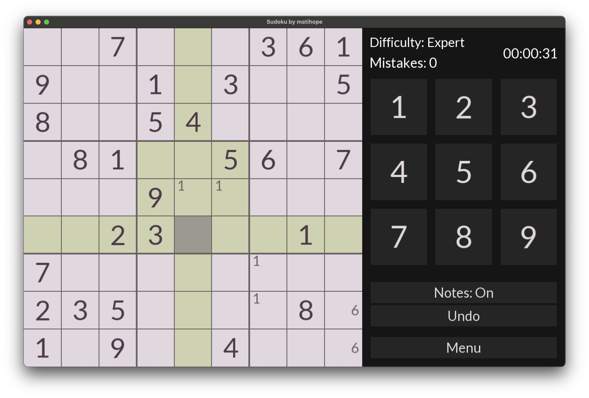

# Sudoku

Fully functional game of Sudoku written in C++ and SFML.



## Controls

Controls are simple - press a square, choose a digit and then press a number key or a button on the right to
place it on the board.

## Hidden feature

Pressing SPACE key fills the board. Useful with "Empty Board" mode, when we want to solve an already existing Sudoku.

## Building


Build it yourself:

1. Install dependencies:
    * Arch Linux:
       ```shell
       sudo pacman -S cmake g++
       ```
    * Debian / Ubuntu:
      ```shell
      sudo apt-get install cmake g++-14
      ```

2. Build project and run:

```shell
bash -c "git clone https://github.com/matihope/Sudoku.git && \
    cd Sudoku && \
    cmake -B build && \
    cmake --build build && \
    ./build/SudokuByMatihope"
```

List of attributions:

* [SFML](https://github.com/SFML/SFML)
* [nlohmann json](https://github.com/nlohmann/json)
* [Lato font](https://fonts.google.com/specimen/Lato) by Lukasz Dziedzic
